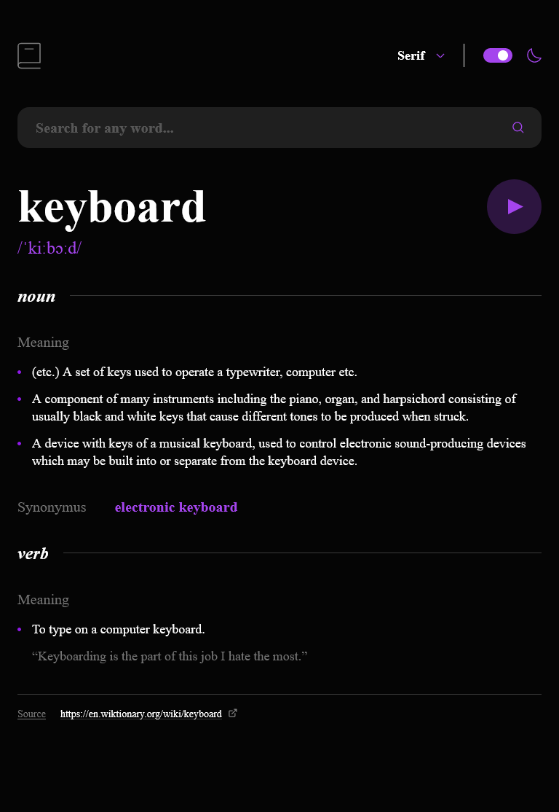

# Frontend Mentor - Dictionary web app solution

This is a solution to the [Dictionary web app challenge on Frontend Mentor](https://www.frontendmentor.io/challenges/dictionary-web-app-h5wwnyuKFL). Frontend Mentor challenges help you improve your coding skills by building realistic projects.

## Table of contents

- [Overview](#overview)
  - [The challenge](#the-challenge)
  - [Screenshot](#screenshot)
  - [Links](#links)
- [My process](#my-process)
  - [Built with](#built-with)
  - [What I learned](#what-i-learned)
  - [Useful resources](#useful-resources)
- [Author](#author)

## Overview

### The challenge

Users should be able to:

- Search for words using the input field
- See the Free Dictionary API's response for the searched word
- See a form validation message when trying to submit a blank form
- Play the audio file for a word when it's available
- Switch between serif, sans serif, and monospace fonts
- Switch between light and dark themes
- View the optimal layout for the interface depending on their device's screen size
- See hover and focus states for all interactive elements on the page
- **Bonus**: Have the correct color scheme chosen for them based on their computer preferences. _Hint_: Research `prefers-color-scheme` in CSS.

### Screenshot

### Links

- Solution URL: [https://github.com/PioKl/Dictionary-Web-App]
- Live Site URL: [https://piokl.github.io/Dictionary-Web-App/]

## My process

### Built with

- Semantic HTML5 markup
- SCSS
- CSS Flexbox
- Mobile-first workflow
- [React](https://reactjs.org/) - JS library
- [Typescript](https://www.typescriptlang.org/) - JS syntax

### What I learned

Practice with: React(hooks, routing, api) and Typescript(generally and types/interface, api)

### Useful resources

- [Clamp Calculator](https://www.marcbacon.com/tools/clamp-calculator/) - To clamp fonts

## Author

- Website - [PioKl](https://github.com/PioKl)
- Frontend Mentor - [@PioKl](https://www.frontendmentor.io/profile/PioKl)
